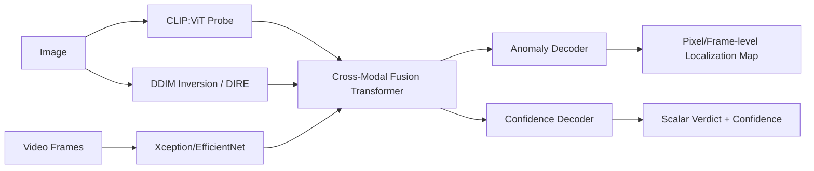

# Fusion & Localization Engine — Architecture Design
Author: Parth Maheshwari
Sprint: Architecture design for the Fusion & Localization Engine (01/10–31/10)

## Purpose
Unify three upstream detection branches into one verdict + localization map:
- **Image branch**: CLIP:ViT probe (`clip_vit_probe.py`) + DIRE residual from DDIM
  inversion (`ddim_inversion.py`)
- **Video branch**: per-frame Xception/EfficientNet features (`video_deepfake_service.py`)
- **AI-generated-image branch**: same CLIP:ViT probe, generator-agnostic head

## Data Flow

## Cross-Modal Fusion Transformer
Each branch's feature vector is projected into a shared embedding dimension,
then combined via multi-head cross-attention so, e.g., a DIRE residual can
attend to the CLIP embedding's spatial patches. Output is one fused
embedding per sample, regardless of which branches were available (video-only
inputs skip CLIP/DIRE terms; still-image inputs skip the video term).

## Dual Decoders
- **Anomaly Decoder**: upsamples the fused embedding back to a spatial map —
  pixel-level heatmap for images, frame-level score sequence for video.
- **Confidence Decoder**: pools the fused embedding to a single authenticity
  score + real/fake label.

## API Contracts
Input/output schemas live in `backend/fusion/contracts.py` — see commits 2–3.
Training of the transformer and decoders is scoped to the next sprint
(01/11–02/01); this sprint only defines contracts and scaffolds the services
so decoder training has a stable interface to target.